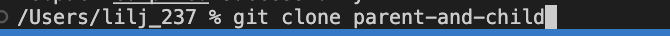
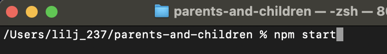
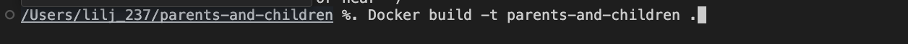
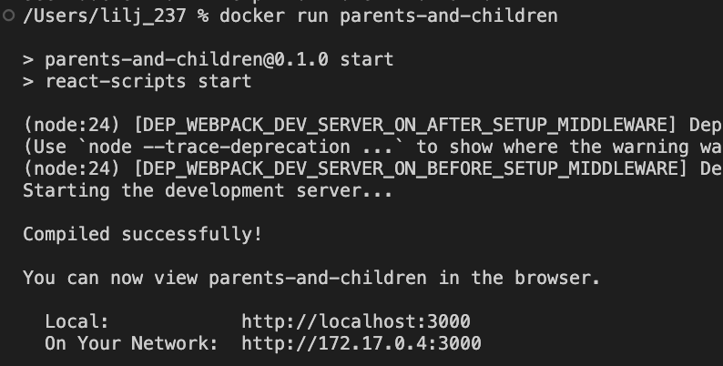
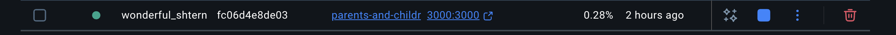
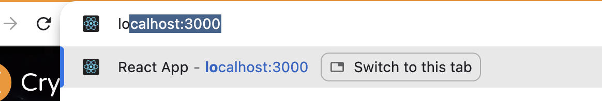
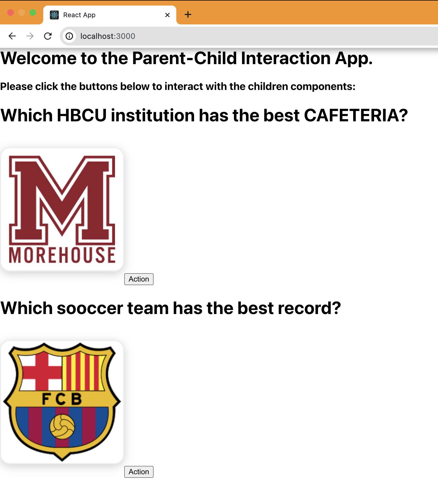

# Getting Started 

## git Clone
Clone the repository unto your desktop from your github
 
This will create a copy of your project on you computer from which you can edit.
 

## Run the code on the terminal
In the project directory, you can run: using "npm start"
 
This can be done in your terminal or the prefered IDE. Open the folder which you are working on.

## git commit -m "comment here"
 

## Docker

### `npm run build`gti
Builds the app for production to the `build` folder.\
It correctly bundles React in production mode and optimizes the build for the best performance.
To dockorize the page use docker build followed with an argument
 
After docker build do ## docker run which will uplaod the folder into the deocker desktop

once completed you should be able to docker folder on the docker desktop

## Deploy

Your app is ready to be deployed!
Runs the app in the development mode.\
Open [http://localhost:3000](http://localhost:3000) to view it in your browser.

 After entering the url you should be be able to see the page 
 

 click on the action button to interact with the page
 